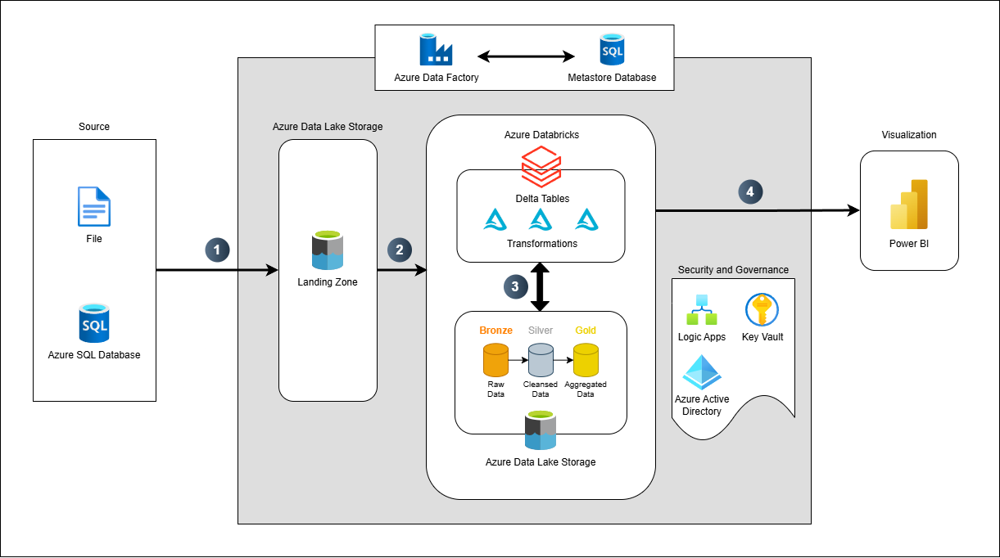

# 🚀 DeltaFlow: Scalable Azure Lakehouse Pipeline

**DeltaFlow** is an end-to-end **data engineering solution** built entirely on **Microsoft Azure**.  
It demonstrates how to design, build, and automate a **modern lakehouse architecture** that is **scalable**, **cost-effective**, and **analytics-ready** — from raw ingestion to curated data consumption through Power BI.

---

## 🧠 Overview

This project simulates a real-world enterprise data platform that processes data from the **AdventureWorks** sample dataset and organizes it into **multi-layered zones** within an Azure Data Lake:

- **Landing Zone:** Temporary raw files from source systems  
- **Bronze Zone:** Raw ingested data in Delta format  
- **Silver Zone:** Cleaned, standardized, and transformed data  
- **Gold Zone:** Aggregated, analytics-ready tables for business use  

The architecture follows **Medallion Architecture** principles and leverages **Azure-native services** for orchestration, transformation, and monitoring.

---

## 🏗️ Architecture

  

---

## ☁️ Tech Stack

| Layer | Azure Services Used | Purpose |
|-------|---------------------|----------|
| **Data Source** | Azure SQL Database | Source transactional data (AdventureWorks) |
| **Ingestion & Orchestration** | Azure Data Factory | Orchestrate ingestion from SQL → Data Lake |
| **Storage** | Azure Data Lake Gen2 | Centralized storage with Landing, Bronze, Silver, Gold zones |
| **Processing & Transformation** | Azure Databricks | ETL transformations, Delta Lake management |
| **Security & Secrets** | Azure Key Vault | Secure management of credentials & connection strings |
| **Monitoring & Alerts** | Azure Logic App | Email alerts for success/failure notifications |
| **Analytics & Visualization** | Power BI | Business-friendly dashboard and data consumption layer |
| **Metadata Management** | Azure SQL Metastore | Track job runs, tables, merge strategies, and incremental loads |

---

## ⚙️ Features

✅ **Modular Lakehouse Zones** — Data organized into Landing, Bronze, Silver, and Gold layers  
✅ **Config-Driven Pipelines** — Dynamic ingestion and transformation via configuration files  
✅ **Databricks Delta Lake** — ACID-compliant tables with incremental upserts and schema evolution  
✅ **Null & Error Handling** — Built-in data quality transformations and error isolation  
✅ **Incremental & Full Loads** — Metadata-driven incremental processing using watermarks  
✅ **Profiling & Auditing** — Automated data profiling stats after each run  
✅ **Email Notifications** — ADF-integrated alerts via Logic Apps  
✅ **Power BI Integration** — Direct connection to the gold zone for reporting  
✅ **SQL Metastore** — Central metadata repository for data governance  

---

## 🔄 Data Flow Summary

1. **Azure SQL → Landing Zone:**  
   ADF copies AdventureWorks sales tables into the landing folder.  
2. **Landing → Bronze Zone:**  
   Raw data copied as-is for traceability.  
3. **Bronze → Silver Zone:**  
   Databricks applies transformations:
   - Column selection & renaming  
   - Null handling  
   - Type casting & filtering  
   - Audit columns & error handling  
4. **Silver → Gold Zone:**  
   Aggregation and star schema generation for Power BI analytics.  
5. **Power BI Dashboard:**  
   Connects directly to Gold Zone via Databricks SQL endpoint.

---

## 🧩 Scalability & Cost Optimization

- Used **Azure Databricks Jobs** with **job clusters** for pay-per-use compute  
- Auto-pause and auto-terminate configurations enabled  
- Reusable **parameterized pipelines** for multi-table ingestion  
- Central **Key Vault** for secret rotation and ADF linked service security  
- **ADF integration runtime** optimized for batch-based scheduling  

---

## 📈 Outcomes

- Fully automated **ELT pipeline** with end-to-end traceability  
- Seamless integration between **ADF, Databricks, and Power BI**  
- Metadata-driven, reusable framework for **future ingestion**  
- Built within a **budget of $150/month** leveraging cost-efficient Azure tiers  

---

## 🧰 Future Enhancements

- Add real-time streaming ingestion via Azure Event Hubs  
- Integrate data quality checks with Great Expectations or Deequ  
- Deploy using CI/CD via GitHub Actions or Azure DevOps  
- Implement role-based access control and lineage visualization  

---

⭐ *If you found this project helpful, consider giving it a star on GitHub!*
